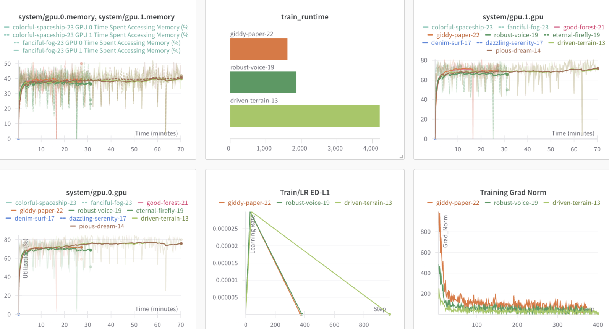
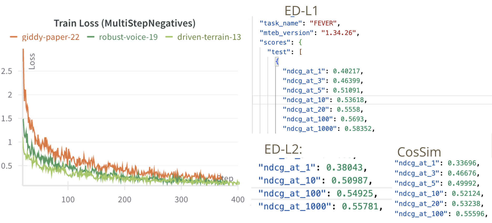

# Energy Distance Project Training and Inference Instructions

## Setting up Python Environment and Installing Required Libraries
1. conda create --name myenv39 python=3.9
2. conda activate myenv39
3. pip install --upgrade pip --index-url https://pypi.org/simple
4. pip install torch==1.13.1+cu117 torchvision==0.14.1+cu117 torchaudio==0.13.1 --extra-index-url https://download.pytorch.org/whl/cu117
5. git clone https://github.com/gnatesan/sentence-transformers-3.4.1.git
6. git clone https://github.com/gnatesan/mteb-1.34.14.git
7. pip install -e /path_to_sentence-transformers/sentence-transformers-3.4.1
8. pip install -e /path_to_mteb/mteb-1.34.14
9. git clone https://github.com/gnatesan/beir.git

## Sanity Check
1. conda create --name testenv python=3.9
2. conda activate testenv
3. pip install --upgrade pip --index-url https://pypi.org/simple
4. pip install sentence-transformers==3.4.1
5. pip install mteb==1.34.26
6. sbatch inference_CosSim.sh (Make sure the batch script calls eval_dataset.py and a baseline model is being used. *i.e. model = SentenceTransformer("Snowflake/snowflake-arctic-embed-m-v1.5")*)
7. Cross reference the inference results with what is on the leaderboard. https://huggingface.co/spaces/mteb/leaderboard

## Model Training
1. cd /path_to_beir/beir/examples/retrieval/training
2. Before running training, make sure the model, model_name, and hyperparameters (LR, scale) are correct. 
nano train_sbert_latest_2.py or nano train_sbert_ddp_2.py to change model, model_name, and LR. 
nano sentence-transformers-3.4.1/sentence-transformers/losses/MultipleNegativesRankingLoss.py to change scale. 
3. sbatch train.sh OR sbatch train_ddp.sh if using multiple GPUs
4. Trained model will be saved in /path_to_beir/beir/examples/retrieval/training/output

## Model Evaluation
1. sbatch inference_ED.sh if evaluating an ED trained model (myenv39 conda environment must be setup)
2. sbatch inference_CosSim.sh if evaluating a cosine similarity trained model (testenv conda environment must be setup)
3. Make sure the proper python script in the batch file is being run (if evaluating entire dataset or subset based on query lengths)

## RPI Cluster Setup
1. ssh <username>@blp01.ccni.rpi.edu
2. ssh nplfen01 (Access NPL front-end node x86)
3. cd ~/barn
4. Follow instructions to install Conda on x86 https://docs.cci.rpi.edu/software/Conda/ (Make sure conda is installed in barn directory)
5. echo 'export PATH="$HOME/miniconda3x86/condabin:$PATH"' >> ~/.bashrc
6. source ~/.bashrc 
7. export http_proxy=http://proxy:8888
export https_proxy=$http_proxy\
source /gpfs/u/home/MSSV/MSSVntsn/barn/miniconda3x86/etc/profile.d/conda.sh\
export TMPDIR=~/barn\
export TRANSFORMERS_CACHE=/gpfs/u/home/MSSV/MSSVntsn/barn\
export HF_HOME=/gpfs/u/home/MSSV/MSSVntsn/barn\
(Step 7 needs to be done every time you log in to the node, replace MSSVntsn with your username)

## IMPORTANT FILES
1. train.sh - Batch script to run model training on a single GPU.  
2. train_ddp.sh - Batch script to run model training on multiple GPUs. Make sure number of GPUs requested are properly set.
3. inference_ED.sh - Batch script to run inference on an ED trained model. Can run on either entire dataset or subset based on query lengths.
4. inference_CosSim.sh Batch script to run inference on a CosSim trained model. Can run on either entire dataset or subset based on query lengths.
5. train_sbert_latest_2.py - Python script to run model training on a single GPU. Uses ir_evaluator to evaluate on a dev set after each epoch of training and only saves the best model, make sure ir_evaluator is enabled.
6. train_sbert_ddp_2.py - Python script to run model training on multiple GPUs using DDP. Currently does not use an ir_evaluator to evaluate on a dev set after each epoch of training.
7. eval_dataset.py - Python script to run inference on entire BEIR dataset.
8. eval_dataset_subset_length.py - Python script to run inference on subset of BEIR dataset based on query lengths.

## IMPORTANT NOTES
1. All files used for training should be present when you clone the gnatesan/beir repository in beir/examples/retrieval/training folder.
2. If working on the RPI cluster NPL node make sure that all installations occur in the ~/barn directory due to larger memory storage. 

## RESULTS (ED-L1)

